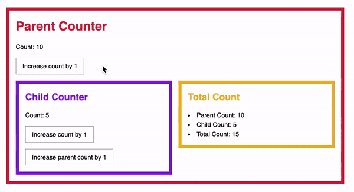

# Framework and Counter App with Vanilla JavaScript


This project is about building a Framework and a Counter App together at the same time to understand the principles behind a Framework and to build something complex with Vanilla JS 
## General Info
In this project I applied the following things: 
- I allow users to render their components onto the DOM. This means users give us the HTML and I render it into the DOM.
- Adding Event Listeners to HTML Elements with custom attributes.
- Updating State
- I use bind function to allow event handleraccess to the state.
- Changing State. To do this I use SetState link React Framework.
- Rendering Child Components
- Passing Props down from parents
- Mounting
- Passing props to descendants. To do this I create a recursive function that runs over and over again, until there are no more descendants.

## Technologies
A list of technologies used within the project:
- HTML
- CSS
- JavaScript

## Installation
A little intro about the installation. 
```
$ git clone git@github.com:santtier/Framework-with-Vanilla-JavaScript.git
$ cd Framework-with-Vanilla-JavaScript
```

## Collaboration
Give instructions on how to collaborate with your project.
There are a set of rules to keep in mind:

- Perform work in a feature branch.
  _Why:_
  > Because this way all work is done in isolation on a dedicated branch rather than the main branch. It allows you to submit multiple pull requests without confusion. You can iterate without polluting the master branch with potentially unstable, unfinished code. [read more...](https://www.atlassian.com/git/tutorials/comparing-workflows#feature-branch-workflow)
- Branch out from `main`

  _Why:_

  > This way, you can make sure that code in master will almost always build without problems, and can be mostly used directly for releases (this might be overkill for some projects).

- Never push into `main` branch. Make a Pull Request.

  _Why:_

  > It notifies team members that they have completed a feature. It also enables easy peer-review of the code and dedicates forum for discussing the proposed feature.

- Delete local and remote feature branches after merging.
  _Why:_
  > It will clutter up your list of branches with dead branches. It ensures you only ever merge the branch back into (`main`) once. Feature branches should only exist while the work is still in progress.

- Comment your code. Try to make it as clear as possible.
- Don't use comments as an excuse for a bad code. Keep your code clean.
- Don't use clean code as an excuse to not comment at all.
- Keep comments relevant as your code evolves.
- Recommended using [JSDoc](https://www.youtube.com/watch?v=r0H-acWQS6c)

## Demo
If you want to see the demo of this proyect deployed, you can visit [Framework](https://santtier.github.io/Framework-with-Vanilla-JavaScript/ "Framework")
